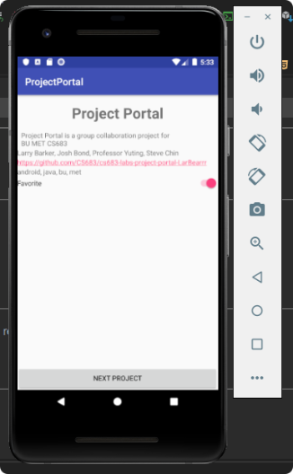
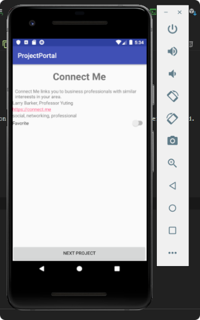

# CS683 Lab2 Report 
### Larry Barker

## Design and Implementation

Briefly explain how you designed and implemented project detail UI with added information. Please also report any issues you have encountered.

The most challenging part here was figuring out how to add a list to
each project. I wasn't able to figure out a way to do this with helper methods;
Instead, I used the Arrays interface and added the list to each project
constructor. I then did some research to figure out how to concatenate
the list items into a comma separated string so I could set the text for 
the TextView of each element.

I really wanted to display the keywords as a tag list, which I learned
would require the use of the Chip and ChipGroup interfaces. Unfortunately,
the app kept crashing when trying to loop through the keywords and add
a chip to the chip group. As a result, I reverted back to using the same
method for the authors and link lists. 

## Testing

Add any screenshots you have to show the execution results

Favorite Project Example

Non-favorite Project Example

